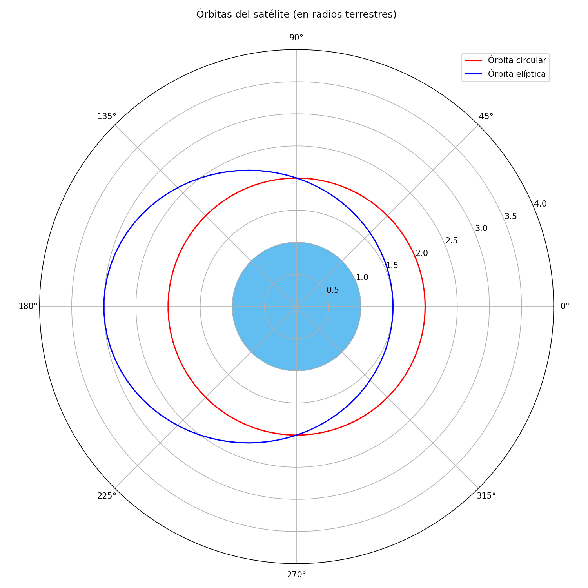
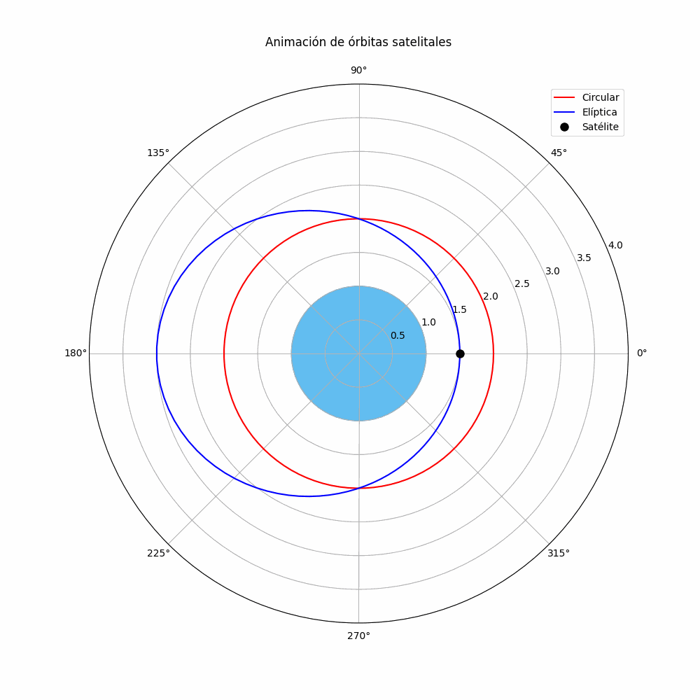

# Problema de Satélite Terrestre  
**Autor**: David Guadalupe Esquila  
**Fecha**: \today  

---

## Enunciado del Problema  

Un satélite terrestre de masa $m = 1000\,\text{kg}$ tiene un momento angular $L = m\sqrt{2GMR}$, donde $R = 6.4 \times 10^6\,\text{m}$ es el radio terrestre y $GM = gR^2$ con $g = 9.81\,\text{m/s}^2$.  

Se pide:  
1. **C)** Determinar la energía específica $E_0$ para órbita circular y su radio $R_0$.  
2. **D)** Para $E = \frac{8}{9}E_0$, calcular:  
   - Los ápsides (perigeo y apogeo).  
   - Velocidades en los extremos.  
3. **E)** Representación gráfica de las órbitas.  

---

## Solución  

### Parte C: Órbita Circular  

$$
\begin{aligned}
L &= m\sqrt{GMr_0} = m\sqrt{2GMR} \\
\Rightarrow r_0 &= 2R = 12.8 \times 10^6\,\text{m} \\
E_0 &= -\frac{GMm}{2r_0} = -\frac{gRm}{4} \\
&= -\frac{(9.81)(6.4 \times 10^6)(1000)}{4} \\
&= \boxed{-1.5696 \times 10^{10}\,\text{J}}
\end{aligned}
$$

---

### Parte D: Órbita Elíptica  

#### Ápsides  

$$
\begin{aligned}
E &= \frac{8}{9}E_0 = -\frac{2gRm}{9} \\
\epsilon &= \sqrt{1 + \frac{2EL^2}{G^2M^2m^3}} = \frac{1}{3} \\
r(\theta) &= \frac{2R}{1 + \frac{1}{3}\cos\theta} \\
\text{Perigeo} &= \left.\frac{2R}{1+\epsilon}\right|_{\theta=0} = 1.5R = \boxed{9.6 \times 10^6\,\text{m}} \\
\text{Apogeo} &= \left.\frac{2R}{1-\epsilon}\right|_{\theta=\pi} = 3R = \boxed{19.2 \times 10^6\,\text{m}}
\end{aligned}
$$

#### Velocidades  

Conservación de energía:  
$$ E = \frac{1}{2}mv^2 - \frac{GMm}{r} $$  

- **En perigeo** ($r = 1.5R$):  
  $$ v_p = \sqrt{\frac{8gR}{9}} \approx \boxed{7470\,\text{m/s}} $$  

- **En apogeo** ($r = 3R$):  
  $$ v_a = \sqrt{\frac{2gR}{9}} \approx \boxed{3735\,\text{m/s}} $$  

---

## Visualizaciones  

### Diagrama de Órbitas  
  
*Figura 1: Órbita circular (rojo) y elíptica (azul) con la Tierra (azul claro) en el centro. Escala en radios terrestres.*  

### Animación  
  
*Figura 2: Animación del satélite (descargar el PDF para verla interactiva).*  

**Nota**:  
- Para ver la animación en acción, descarga el PDF y ábrelo con Adobe Reader.  
- El código Python para generar las visualizaciones está disponible en [`orbita_satelite.py`](orbita_satelite.py).  

---

### Referencias  
- Paquetes LaTeX usados: `amsmath`, `siunitx`, `graphicx`.  
- [Enlace a Overleaf](https://www.overleaf.com/read/tu-enlace) (si aplica).  
